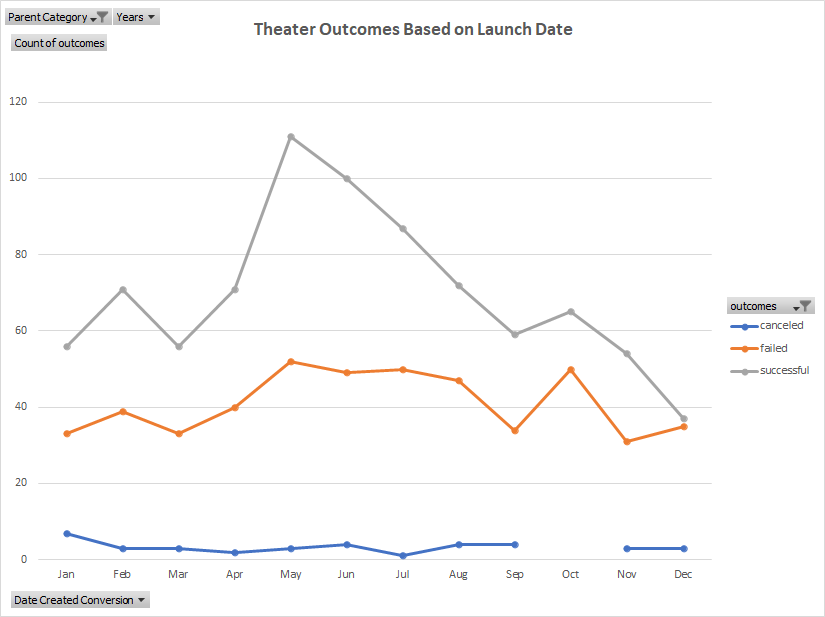
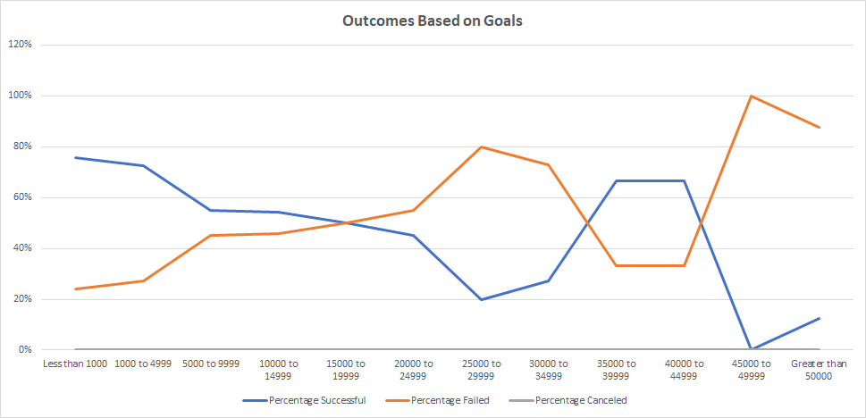

# RBC-Module-1-Kickstarter-Analysis

## Overview of Project

### Purpose
The purpose of this project was to provide a thorough analysis based on the Kickstarter Campaigns dataset, which had a sample population of more than 4000 campaigns across multiple countries, categories and subcategories. The project helped us find trends between successful, failed and canceled campaigns.

## Analysis and Challenges
The process used to perform the analysis and providing this written report was done through various steps in order:
1. Applying conditional formatting on the dataset to get a better visual representation of the data.
2. Custom sorting and filtering to further filter out the information that we are particularly focused on for our pattern analysis and trend recognition.
3. Finally, using the filtered information and applying the data ranges and further modifying the parameters to create pivot-tables and create customized charts (line and stacked-column) for an enchanced trend outcome.
  
### Analysis of Outcomes Based on Launch Date
The line graph below shows the relationship between the Kickstarter Campaign Launch Dates, which are defined by specific months based on a yearly calender. The years filter is available but not applied as we are trying to find a corelation between the months of the launch date and the count of the campaign outcomes which are categorized into three major categories of "successful", "failed" and "canceled". Since our analysis is focused on providing Louise with a clearer picture on a particular subset of the Parent category, namely "plays", this filter is applied to the table.

### Analysis of Outcomes Based on Goals
The line graph shown below provides a visual representation of the relationship between Percentage of all the Outcomes based on there respective outcomes of successful, failed, canceled and live, while using their respective goals amount (in $) and created ranges for the graph.

### Challenges and Difficulties Encountered
After having worked on this project, I have realized the potential of Excel as a data analytics tool for extracting and filtering necessary and relevant information from a particular dataset to recognize patterns and trends in a meaningful way, all the while creating graphs for a supplemental visual representation. The challenges that I had faced include:
1. Nesting of formulas such as the usage of `IFERROR()` formula having the `ROUND()` or other mathematical formulas nested inside it. Knowing which formulas are capable of nesting was a challenge for me.
2. Referencing of data in formulas. As the original kickstarter file initially required us to create three sheets which were based on the "Successful", "Failed" and their "Descriptive Statistics". However, removal of these sheets made the formula references incorrect thereby providing us with a `#REF` error. If we wanted to maintain the "Descriptive Statistics" sheet without the use of Successful and Failed sheets, while directly applying the filter to the main Kickstarter sheet, this caused some complications where `IFS()` statements could only be used for the formula and multiple criteria while `AVERAGEIF()` formula did not work as it requires the criteria for filtering (outcomes) to be on the "left" side of the column that would be filtered, namely goals.

## Results

- What are two conclusions you can draw about the Outcomes based on Launch Date?
The two things to note here are:
1. Most of the successful kickstarter campaigns had started in the periods between March and May.
2. There was a steady decline after the month of May. Which can be seen in the graph during the periods of May up until the end of the graph. However, the period of October saw a slight increase where none of the kickstarter campaigns were canceled.

- What can you conclude about the Outcomes based on Goals?
The line graph for "Percentage Failed" is an approximate mirror image of the "Percentage Successful". Here we can see that the Graph is consistent with increase in areas where Goals range from 5000-9999 (in USD) until 20000-24999 for the "plays" subcategory.

- What are some limitations of this dataset?
1. Since the dataset is spanning across multiple years and we don't have specific pointers providing us the necessary information regarding the changing global economies and recession. The dataset could be biased in a multitude of ways.
2. We do not have reviews for the dataset which could have provided further details regarding which types of plays were tending to be more successful.

- What are some other possible tables and/or graphs that we could create?
1. An additional graph as shown below is a Box and Whisker plot for the UK "Plays".
2. An additional graph as shown below is a Outcomes vs Parent Category which is filtered to "Theater".
3. Another graph that we could have used to further analyze the kickstarter campaign dataset would have been to create a form of correlation between the length of the campaigns (possibly within the "Plays" subcategory) to see what average length was to be expected for a successful kickstarter campaign.
